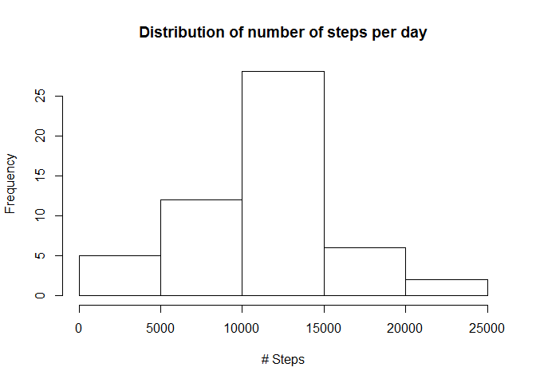
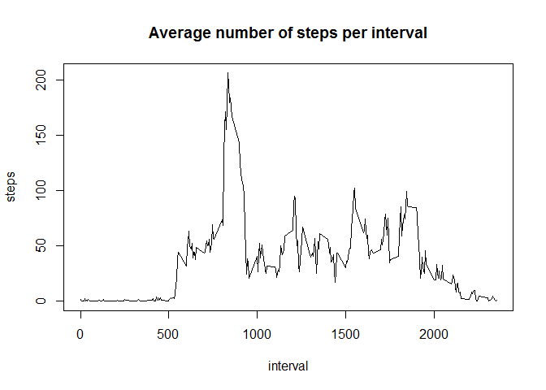
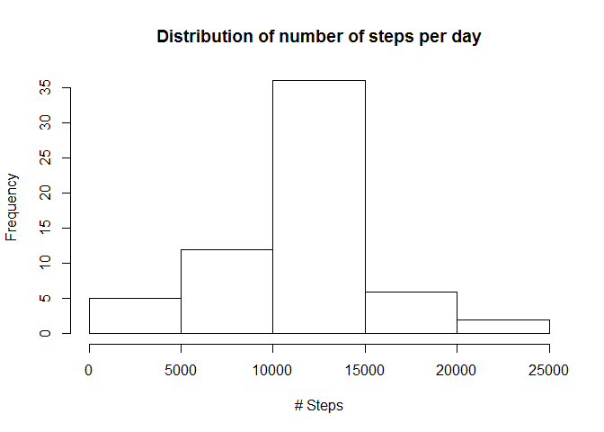
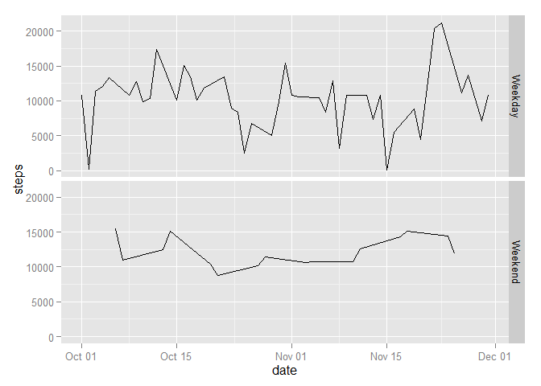

# Reproducible Research: Peer Assessment 1


## Loading and preprocessing the data
Let's unzip the data, read it into R, set the right data types for the resulting data frame and look at the first few lines.

```r
unzip("activity.zip")
mydata <- read.csv("activity.csv")
mydata$date <- as.Date(mydata$date)
head(mydata)
```

```
##   steps       date interval
## 1    NA 2012-10-01        0
## 2    NA 2012-10-01        5
## 3    NA 2012-10-01       10
## 4    NA 2012-10-01       15
## 5    NA 2012-10-01       20
## 6    NA 2012-10-01       25
```

## What is mean total number of steps taken per day?
We'll start by summarizing the number of steps per day in a new data frame.

```r
library(plyr)
mydata_perday <-  ddply(mydata, .(date), summarise, steps=sum(steps))
head(mydata_perday)
```

```
##         date steps
## 1 2012-10-01    NA
## 2 2012-10-02   126
## 3 2012-10-03 11352
## 4 2012-10-04 12116
## 5 2012-10-05 13294
## 6 2012-10-06 15420
```

Looks like we have some days without any data (all intervals NA). We'll exclude those days.
Here, we plot a histogram of the distribution of number of steps per day and calculate the mean and median steps per day.

```r
mydata_perday_complete <- mydata_perday[complete.cases(mydata_perday),]
hist(mydata_perday_complete$steps, main = "Distribution of number of steps per day", xlab = "# Steps")
```

 

```r
mean(mydata_perday_complete$steps)
```

```
## [1] 10766.19
```

```r
median(mydata_perday_complete$steps)
```

```
## [1] 10765
```

## What is the average daily activity pattern?
To explore trends in the amount of steps taken by interval, we'll look at the mean amount of steps per interval, excluding missing values.

```r
mydata_perinterval <-  ddply(mydata[complete.cases(mydata),], .(interval), summarise, steps=mean(steps))
head(mydata_perinterval)
```

```
##   interval     steps
## 1        0 1.7169811
## 2        5 0.3396226
## 3       10 0.1320755
## 4       15 0.1509434
## 5       20 0.0754717
## 6       25 2.0943396
```

```r
plot(mydata_perinterval, type = 'l', main = "Average number of steps per interval")
```

 

We can see the number of steps peak at this interval.

```r
mydata_perinterval[(which.max(mydata_perinterval[,2])),]
```

```
##     interval    steps
## 104      835 206.1698
```

## Imputing missing values
Next, we will calculate the number of missing values in the dataset.

```r
nrow(mydata[complete.cases(mydata),])
```

```
## [1] 15264
```

```r
nrow(mydata[!complete.cases(mydata),])
```

```
## [1] 2304
```

Let's input the mean over the interval number for all missing values (E.G. if we have a missing value at interval 1, we will calculate the mean over all interval # 1's and input that mean). 

```r
impute.mean <- function(x) replace(x, is.na(x), mean(x, na.rm = TRUE))
mydata_replaced <- ddply(mydata, ~ interval, transform, steps = impute.mean(steps))
mydata_replaced <- mydata_replaced[order(mydata_replaced$date), ]
head(mydata_replaced)
```

```
##         steps       date interval
## 1   1.7169811 2012-10-01        0
## 62  0.3396226 2012-10-01        5
## 123 0.1320755 2012-10-01       10
## 184 0.1509434 2012-10-01       15
## 245 0.0754717 2012-10-01       20
## 306 2.0943396 2012-10-01       25
```

```r
mydata_perday_replaced <-  ddply(mydata_replaced, .(date), summarise, steps=sum(steps))
hist(mydata_perday_replaced$steps, main = "Distribution of number of steps per day", xlab = "# Steps")
```

 

```r
mean(mydata_perday_replaced$steps)
```

```
## [1] 10766.19
```

```r
median(mydata_perday_replaced$steps)
```

```
## [1] 10766.19
```

We can see that we' ve further normalized the distribution of the amount of steps per day, by replacing the missing data with the interval means. Additionally, the median has converged to the mean.

## Are there differences in activity patterns between weekdays and weekends?


```r
mydata_replaced$weekday <- as.factor(weekdays((mydata_replaced$date)))
weekend_days <-c("Saturday","Sunday")
mydata_replaced$is_weekend <- (mydata_replaced$weekday) %in% weekend_days

library(car)
```

```
## Warning: package 'car' was built under R version 3.2.1
```

```r
mydata_replaced$is_weekend <- recode(mydata_replaced$is_weekend, "c(0)='Weekday'; 
    else='Weekend'")

library(ggplot2)
mydata_replaced_weekday <- ddply(mydata_replaced, .(date, is_weekend), summarise, steps=sum(steps))
ggplot(mydata_replaced_weekday, aes(date,steps)) + geom_line() + facet_grid(is_weekend ~ .)
```

 
